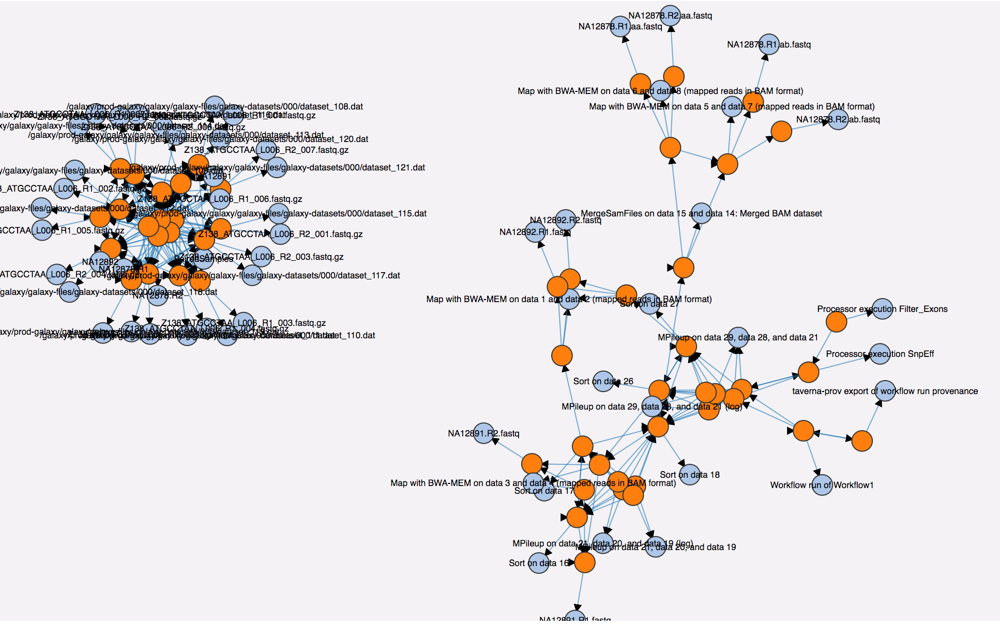

# SHARP provenance toolbox 

## Synopsis
SHARP is a reasearch prototype aimed at harmonizing heterogeneous provenance graphs through reasoning (PROV inferences). [PROV Constraints inferences rules](https://www.w3.org/TR/prov-constraints/) have been implemented through the JENA forward chaining inference engine. 

## Motivations
Several ontologies have been proposed to extend the multi-purpose PROV-O ontology, such as [prov-one](http://vcvcomputing.com/provone/provone.html), [wfprov](http://lov.okfn.org/dataset/lov/vocabs/wfprov). The mutiplication of PROV-extended vocabularies makes it diffcult to link and cross-exploit multi-systems provenance graphs. In addition, even if workflow management systems produce strictly PROV-O entities, there is no guaranty that the same classes and properties are used, which possibly leads to non joinable graphs. 

**With SHARP, our goal is to propose reasoning mechanisms to produce harmonized provenance graphs, that can be more easily  linked together and shared.**

## Usage in command line
SHARP is available as a standalone command line interface. Here is the description of the command line parameters : 

    usage: SharpTB [-h] [-i <input_file_1> ... <input_file_n>] [-s] [-v]
    SharpTB is a tool to maturate provenance based on PROV inferences
         -h,--help                                            print the help
         -i,--input_files <input_file_1> ... <input_file_n>   The list of PROV
                                                              input files, in RDF
                                                              Turtle.
         -s,--summary                                         Materialization of
                                                              wasInfluencedBy
                                                              relations.
         -v,--version                                         print the version
                                                              information and exit

It can be used to infer PROV statements for a single provenance trace : 

    java -jar SHARP-1.0-SNAPSHOT-launcher.jar -i sample-data/provstore-114819.ttl -s
    
Or it can be used to interlink and harmonize cross workflow provenance traces, as demonstrated here : 

    java -jar SHARP-1.0-SNAPSHOT-launcher.jar -i sample-data/galaxy.prov.ttl sample-data/taverna.prov.ttl sample-data/sameas.ttl -s
    
Finally, the `-s` option generates a visualization of the resulting provenance graph. In the following screenshot, a workflow partly enacted on Galaxy and Taverna is depicted : 

   
## Usage as an API
The project can be compiled as follows : 

    cd SharpProvToolbox
    mvn clean install -Dmaven.test.skip=true
    
Then, when this jar is in your classpath, you can benefit from PROV inferences as follows. 
    
An RDF PROV graph can be loaded with the JENA API : 
    
    String inputGraph = "Your PROV graph in TTL syntax";
    Model data = ModelFactory.createDefaultModel();
    InputStream stream = new ByteArrayInputStream(inputGraph.getBytes(StandardCharsets.UTF_8));
    RDFDataMgr.read(data, stream, Lang.TTL);
    
Then, the inferences and blank node unification is performed as follows : 

    Model res = Harmonization.harmonizeProv(data);
    Util.dumpPredStats(res); // prints the main predicates in the graph
   
Finally, we povides a basic visualization of the resulting PROV graph, based on the D3.js framework :
    
    Util.writeHtmlViz(data);
    Util.writeHtmlViz(res);

## Maven dependencies 
...
## License
...
